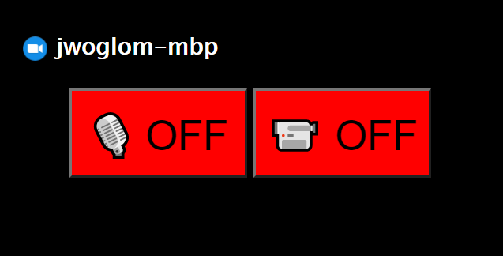

# zoom-tools



Zoom Tools provides a system which allows for managing an instance of Zoom on MacOS remotely.
It includes the following components:

* **client** - runs on the computer which hosts Zoom. Uses a webserver running on port 2626 to run AppleScript commands to query and interact with Zoom. It supports:
  * Querying audio status
  * Querying video status
  * Turning audio on and off
  * Turning video on and off
* **display** - runs on a computer on the same local network as the client. Hosts a webserver which renders a widget for controlling the state of Zoom, which interfaces via WebSocket to the display server.

On the client machine, a LaunchAgent plist file is provided which starts the client webserver in the background. On the display machine, supervisord or another method can be used to run the server.

On the client machine, invoke the `zoom_started.sh` and `zoom_stopped.sh` scripts when Zoom is opened or closed.
If using a window manager such as Yabai, which has triggers, you can configure these scripts to run whenever Zoom is opened or closed:

```
yabai -m signal --add event=application_launched app="^zoom.us$" action="/path/to/zoom-tools/client/zoom_started.sh"

yabai -m signal --add event=application_terminated app="^zoom.us$" action="/path/to/zoom-tools/client/zoom_stopped.sh"
```